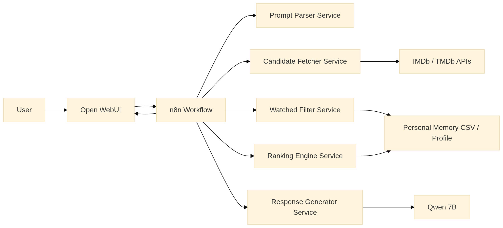
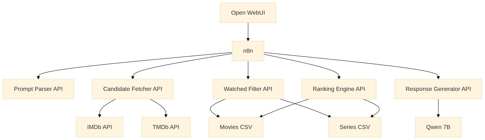
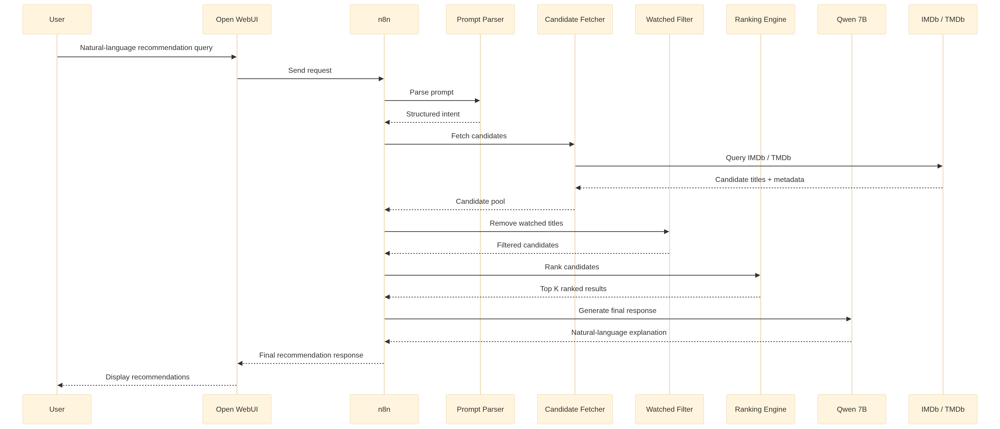
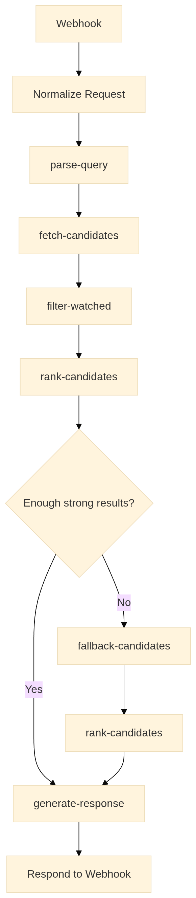

# Next In Line

A **personalized movie & series recommendation system** that combines:

- **Netflix watch-history CSV** as a personal memory profile
- **IMDb / TMDb** for live candidate retrieval and metadata enrichment
- **Prompt-aware query understanding** through an LLM
- **Weighted ranking** using genres, directors, actors, and long-term memory strength
- **n8n** as the workflow orchestrator
- **Open WebUI** as the frontend interface
- **Qwen 7B** as the default model for prompt parsing and final natural-language generation

This version keeps the architecture **simple, modular, and explainable**:

- **Candidates come from IMDb / TMDb**
- **Your CSV builds the personal memory layer**
- **Python services perform filtering and ranking**
- **n8n orchestrates the workflow**
- **Qwen 7B interprets the query and writes the final response**

**Important design choice:**
This version does **not** maintain long-term prompt context in a database yet. Open WebUI handles the immediate interaction, and persistent conversation memory is left as **future work**.

Example queries it can handle:

- "Suggest some light-hearted mystery shows like *Wednesday*, nothing too dark."
- "Give me movies similar to *Inception* and *Shutter Island*, avoid horror."
- "Recommend comfort sitcoms based on what I usually watch."
- "Suggest movies by Nolan, but give me some unexplored options too."

---

## Table of Contents

1. [Project Goals](#project-goals)
2. [High-Level Architecture](#high-level-architecture)
   - [System Overview](#system-overview)
   - [Design Principle](#design-principle)
3. [System Design](#system-design)
   - [Component Diagram](#component-diagram)
   - [Sequence Diagram](#sequence-diagram)
   - [n8n Workflow Diagram](#n8n-workflow-diagram)
4. [Data Model](#data-model)
   - [How the Dataset Was Built](#how-the-dataset-was-built)
   - [Netflix CSV as Personal Memory](#netflix-csv-as-personal-memory)
   - [Feature Engineering](#feature-engineering)
5. [Personalization Logic](#personalization-logic)
   - [Prompt Parsing Logic](#prompt-parsing-logic)
   - [Personal Memory Strength](#personal-memory-strength)
   - [Ranking Strategy](#ranking-strategy)
   - [Stronger Recommendation Boost](#stronger-recommendation-boost)
6. [Model Choice](#model-choice)
7. [n8n Orchestration Design](#n8n-orchestration-design)
8. [Repository Structure](#repository-structure)
9. [Module Design](#module-design)
10. [Setup & Installation](#setup--installation)
11. [Running the System](#running-the-system)
12. [Future Work / Roadmap](#future-work--roadmap)
13. [References](#references)
14. [Privacy Notes](#privacy-notes)
15. [License](#license)

---

## Project Goals

- Build a **fully personal** recommender using Netflix watch history as memory
- Retrieve **fresh recommendation candidates** from IMDb / TMDb
- Remove already watched titles before ranking
- Interpret broad and specific prompts differently
- Use **weighted ranking** based on:
  - prompt intent
  - genre match
  - director match
  - actor match
  - personal memory strength
  - basic quality / exploration signals
- Orchestrate the full flow through **n8n**
- Generate final natural-language output through **Open WebUI + Qwen 7B**

---

## High-Level Architecture

### System Overview




**Flow:**

1. User sends prompt through **Open WebUI**
2. Open WebUI sends the request to **n8n**
3. n8n calls a **prompt parser** to structure the query
4. n8n calls **IMDb / TMDb-backed candidate fetcher**
5. Already watched titles are removed using the personal memory dataset
6. Remaining candidates are scored by the ranking engine
7. Strong recommendation boosting is applied using repeated personal patterns
8. Final ranked results are sent to **Qwen 7B** for natural-language response generation
9. n8n returns the final answer to Open WebUI

---

### Design Principle

This project follows one main rule:

> **External APIs provide the candidate pool. Personal memory personalizes the ranking.**

That means:

- **IMDb / TMDb** answer: *What is available?*
- **Netflix CSV** answers: *What do I usually like?*
- **Prompt parser** answers: *What do I want right now?*
- **Ranking engine** answers: *Which candidates best satisfy both?*

---

## System Design

### Component Diagram



---

### Sequence Diagram



---

### n8n Workflow Diagram



---

## Data Model

### How the Dataset Was Built

The personal dataset was built from **Netflix viewing history** downloaded per profile. In simple terms:

1. Download watch history from Netflix
2. Remove the profile name field
3. Keep title names and ratings / thumbs feedback
4. Remove duplicates
5. Use **IMDb / TMDb** metadata to enrich each title with:
   - type (movie / series)
   - genre
   - director
   - main actors
6. Split the final data into **movies** and **series**
7. Normalize preference strength using ratings / weights

This produces a structured and mostly frozen personal memory dataset.

---

### Netflix CSV as Personal Memory

You maintain enriched Netflix watch-history datasets such as:

- `data/film.csv`
- `data/series.csv`

These files are **not** the source of recommendation candidates.
They are used to build a **personal memory profile**.

**Purpose of the CSV:**

- titles already watched
- normalized rating / preference signals
- repeated genre patterns
- repeated director patterns
- repeated actor patterns
- movie vs series preference

**Typical columns:**

| Column | Description |
|--------|-------------|
| `Title Name` | Title name from Netflix export |
| `Thumbs Value` | Like / neutral / dislike feedback |
| `Weightage` | Manual or normalized importance |
| `Genre` | Comma-separated genres |
| `Director` | Director name(s) |
| `Actors` | Comma-separated main cast |
| `Type` | Movie or Series |

---

### Feature Engineering

At preparation time, the system:

1. Loads your movies and series CSV files
2. Removes duplicates
3. Standardizes genres, actors, and directors
4. Builds weighted memory signals from ratings and frequency
5. Creates a personal memory profile such as:

```text
Christopher Nolan -> 0.92
David Lynch       -> 0.71
Sci-Fi            -> 0.88
Thriller          -> 0.84
Actor X           -> 0.76
Movies            -> 0.81
Series            -> 0.63
```

This memory profile becomes the personalization layer used during ranking.

---

## Personalization Logic

### Prompt Parsing Logic

The first step is understanding the prompt.

The system checks whether the user explicitly asks for:

- a **director**
- a **genre**
- an **actor**
- a **seed title**
- a **content type** (movie / series)
- an **exclusion** (for example: avoid horror)

**Example:**

Input:

```text
Recommend mystery series, not too dark
```

Parsed intent:

```json
{
  "query_type": "specific",
  "requested_director": null,
  "requested_genres": ["mystery"],
  "requested_actors": [],
  "seed_title": null,
  "exclude_genres": ["horror"],
  "type": "series"
}
```

**Rule:**

- If the prompt is **specific**, prioritize the requested signal.
- If the prompt is **broad**, use a hybrid scoring approach across all major signals.

---

### Personal Memory Strength

The personal memory layer does not just check whether something matches.
It checks **how strongly it matches long-term taste**.

For example, if the watch history shows many highly weighted Nolan titles, then:

- Nolan-based recommendations get a stronger boost
- similar genres may also get reinforcement
- related actors/directors can gain partial support

This converts the project from a simple metadata matcher into a stronger personalized recommender.

---

### Ranking Strategy

After candidates are fetched from IMDb / TMDb and watched titles are removed, the ranking engine scores the rest.

#### If the prompt is specific

```text
Final Score =
0.45 * Prompt Match
+ 0.35 * Personal Memory Match
+ 0.15 * Candidate Quality
+ 0.05 * Exploration
```

#### If the prompt is broad

```text
Final Score =
0.25 * Prompt Match
+ 0.50 * Personal Memory Match
+ 0.20 * Candidate Quality
+ 0.05 * Exploration
```

#### Personal Memory Match

```text
Personal Memory Match =
0.40 * Director Memory Strength
+ 0.30 * Genre Memory Strength
+ 0.20 * Actor Memory Strength
+ 0.10 * Type Preference
```

---

### Stronger Recommendation Boost

A final boosting layer strengthens candidates that align closely with repeated long-term patterns.

**Example:**

If the memory profile strongly favors Nolan, sci-fi, and thriller, then a new candidate with those features will get an additional recommendation boost.

This makes the output more aligned with actual user taste instead of only prompt-level matching.

---

## Model Choice

This project keeps **Qwen 7B** as the default model because it was already part of the earlier version of the system.

### Why keep Qwen 7B here

- it matches the previous project setup
- it avoids changing too many variables while rectifying the workflow
- it is sufficient for:
  - prompt parsing
  - intent extraction
  - final natural-language recommendation writing

### Could Llama be used instead?

Yes. A small **Llama** model can also be used if deployment is easier in your environment.

### Current recommendation

For this project version:

- **Keep Qwen 7B** if you already have it working
- switch to **Llama** only if your local setup, tooling, or inference flow is easier with Llama

That keeps the project stable while you refine the pipeline.

---

## n8n Orchestration Design

In this project, **n8n is the workflow orchestrator**.

It is responsible for:

- receiving the request from Open WebUI
- calling the prompt parser
- calling the candidate retrieval service
- calling the watched filter
- calling the ranking engine
- applying fallback logic if needed
- calling the final response generator
- returning the result to the frontend

n8n is **not** used to implement the actual ranking formula. That logic stays in Python services.

### Suggested APIs behind n8n

- `POST /parse-query`
- `POST /fetch-candidates`
- `POST /filter-watched`
- `POST /rank-candidates`
- `POST /fallback-candidates`
- `POST /generate-response`

---

## Repository Structure

```text
next-in-line/
├── .venv/
├── app/
├── data/
│   ├── film.csv
│   └── series.csv
├── docker/
│   ├── .cache/
│   ├── .env
│   ├── build.sh
│   ├── docker-compose.yml
│   ├── dockerfile
│   ├── entrypoint.sh
│   ├── README.md
│   ├── requirements.txt
│   └── server.py
├── images_for_readme/
├── src/
├── readme.md
├── requirements.txt
└── next_in_line_project_note.docx
```

---

## Module Design

### 1. CSV Preparation Module
Builds the clean personal memory dataset from Netflix watch history.

### 2. Prompt Parser Module
Converts natural-language queries into structured intent.

### 3. Candidate Fetcher Module
Fetches external recommendation candidates from IMDb / TMDb.

### 4. Watched Filter Module
Removes already watched titles using personal memory.

### 5. Ranking Engine Module
Scores candidates using prompt intent, memory strength, quality, and exploration.

### 6. Stronger Recommendation Booster
Applies an additional boost to items strongly aligned with repeated patterns.

### 7. Response Generator Module
Packages final ranked items for natural-language response creation.

### 8. n8n Workflow Layer
Connects all modules into a single visible pipeline.

---

## Setup & Installation

### Prerequisites

- Docker and Docker Compose
- Python 3.10+
- TMDb API key
- IMDb access method or adapter service
- Open WebUI
- n8n
- Local LLM runtime
- Personal Netflix CSV files

---

### 1. Clone Repository

```bash
git clone https://github.com/jv-abhilash/next-in-line.git
cd next-in-line
```

---

### 2. Prepare Your Data

Place your CSV files in the `data/` directory:

```text
data/
├── film.csv
├── series.csv
└── .gitignore
```

**Important:** add the real personal files to `.gitignore`.

---

### 3. Configure Environment

Create a `.env` file:

```bash
TMDB_API_KEY=xxxxxxxxxxxxxxxxxxxxxxxx
IMDB_ADAPTER_URL=http://localhost:8010
LLM_MODEL=qwen2.5:7b
LLM_API_URL=http://ollama:11434
OPENWEBUI_URL=http://localhost:3000
N8N_WEBHOOK_URL=http://localhost:5678/webhook/recommend
```

---

### 4. Install Python Dependencies

```bash
python -m venv .venv
source .venv/bin/activate
pip install -r requirements.txt
```

**`requirements.txt`**

```text
pandas>=2.0.0
numpy>=1.24.0
scikit-learn>=1.3.0
fastapi>=0.100.0
uvicorn[standard]>=0.23.0
python-dotenv>=1.0.0
requests>=2.31.0
```

---

### 5. Docker Setup

Example `docker-compose.yml`:

```yaml
version: '3.8'

services:
  n8n:
    image: docker.n8n.io/n8nio/n8n
    ports:
      - "5678:5678"
    environment:
      - TZ=Asia/Kolkata
    volumes:
      - ~/.n8n:/home/node/.n8n

  open-webui:
    image: ghcr.io/open-webui/open-webui:main
    ports:
      - "3000:8080"
    depends_on:
      - n8n
      - ollama

  ollama:
    image: ollama/ollama:latest
    ports:
      - "11434:11434"

  recommender-api:
    build:
      context: .
      dockerfile: docker/Dockerfile.api
    ports:
      - "8001:8001"
    volumes:
      - ./data:/data:ro
```

---

## Running the System

### 1. Start Docker Services

```bash
docker compose up -d
```

### 2. Pull the Model

```bash
docker exec -it <ollama-container-name> ollama pull qwen2.5:7b
```

### 3. Import the n8n Workflow

1. Open n8n at `http://localhost:5678`
2. Import `workflows/n8n_main_workflow.json`
3. Configure API endpoints and credentials
4. Activate the workflow

### 4. Use Through Open WebUI

Open `http://localhost:3000` and try:

> "Recommend mystery series similar to Wednesday but lighter in tone"

The flow will:

1. send the request to n8n
2. parse the prompt
3. fetch candidate titles
4. remove watched titles
5. rank results based on personal memory
6. generate the final natural-language output

---

## Future Work / Roadmap

- move structured personal memory into **SQL** if the dataset becomes larger or more dynamic
- add **RAG / vector storage** for semantic retrieval and vibe-based recommendations
- add **context-based prompting** using saved conversation history or prompt memory
- persistent database for conversation and recommendation history
- user feedback loop with thumbs up/down updates
- local metadata cache to reduce repeated API calls
- multi-user support
- poster, trailer, and streaming availability enrichment
- recommendation quality metrics and evaluation dashboard

---

## References

- [n8n Docker Installation](https://docs.n8n.io/hosting/installation/docker/)
- [n8n Docker Compose Guide](https://docs.n8n.io/hosting/installation/server-setups/docker-compose/)
- [Docker Engine Installation](https://docs.docker.com/engine/install/)
- [Open WebUI Quick Start](https://docs.openwebui.com/getting-started/quick-start/)
- [TMDb API Getting Started](https://developer.themoviedb.org/docs/getting-started)
- [TMDb Discover Movie API](https://developer.themoviedb.org/reference/discover-movie)
- [IMDb Developer Documentation](https://developer.imdb.com/documentation/)
- [IMDb API Overview](https://developer.imdb.com/documentation/api-documentation/)
- [Netflix Viewing History Help](https://help.netflix.com/en/node/101917)
- [Qwen 2.5 7B Instruct](https://huggingface.co/Qwen/Qwen2.5-7B-Instruct)

**Dataset note:**
The personal dataset in this project was built from **Netflix profile viewing history**, then cleaned, deduplicated, and enriched with IMDb / TMDb metadata.

---

## Final Note

This version focuses on a **clean and modular architecture**:

- structured prompt parsing
- external candidate retrieval
- personal memory-driven ranking
- n8n workflow orchestration
- natural-language frontend interaction

Conversation-level long-term context storage is intentionally kept as **future work** so the core recommendation flow stays simple, correct, and easy to extend later.
