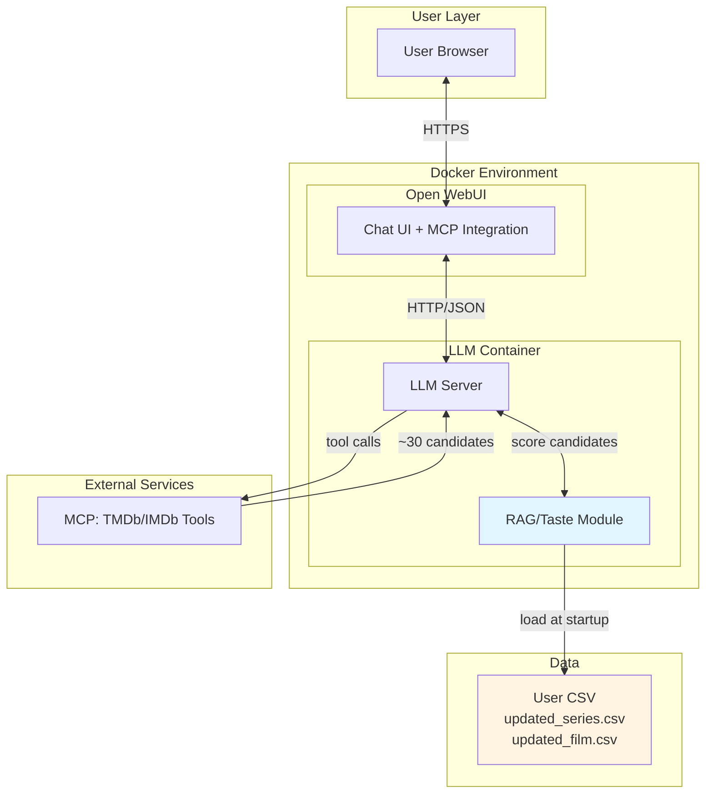
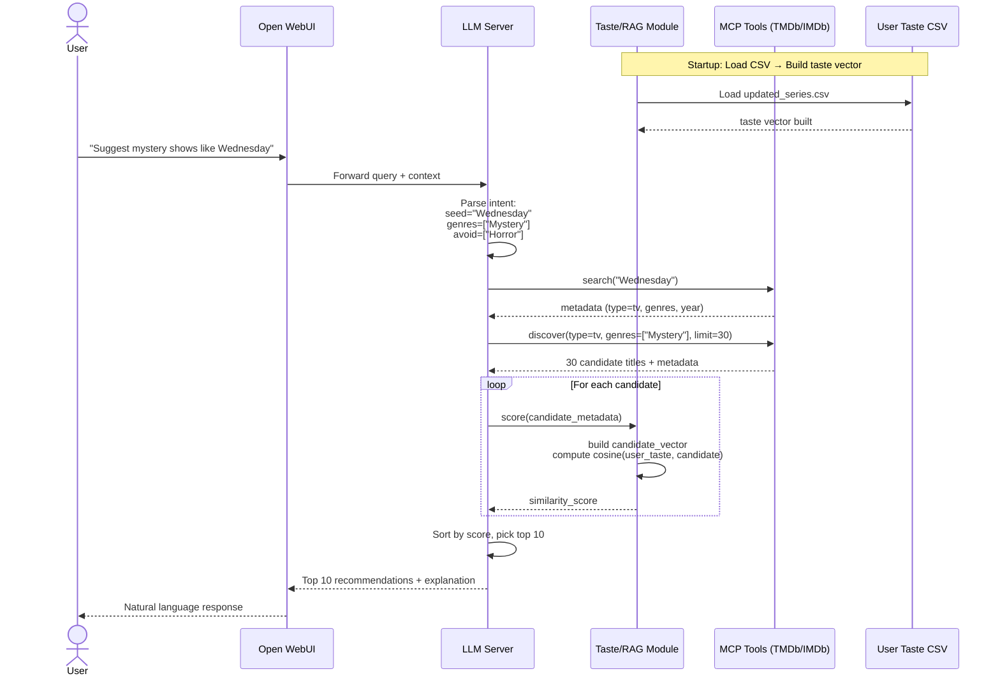

# Personal Netflix LLM Recommender (RAG + TMDb/IMDb via MCP)

This project is a **personalized movie & series recommender** that combines:

- **Your Netflix viewing history** as a taste profile (genres, cast, directors, preferences)
- **Live candidate retrieval** from TMDb/IMDb via MCP tools
- **RAG-style re-ranking** using content-based similarity between your taste and candidates
- **LLM-powered natural language interface** via Open WebUI

**Key Architecture Insight:**
- **Candidates come from TMDb/IMDb** (not from your CSV)
- **Your CSV builds a "user taste vector"** for re-ranking those candidates
- **LLM orchestrates** the flow: query understanding → candidate retrieval → taste-based scoring → explanation

Example queries it handles:

- "Suggest some light-hearted mystery shows like *Wednesday*, nothing too dark."
- "Give me movies similar to *Inception* and *Shutter Island*, avoid horror."
- "Recommend comfort sitcoms based on what I already watch."

---

## Table of Contents

1. [Project Goals](#project-goals)  
2. [High-Level Architecture](#high-level-architecture)
   - [System Overview](#system-overview)
   - [RAG Flow Explained](#rag-flow-explained)
3. [System Design](#system-design)
   - [Component Diagram](#component-diagram)
   - [Sequence Diagram](#sequence-diagram)
4. [Data Model](#data-model)
   - [User Taste CSV](#user-taste-csv)
   - [Feature Engineering](#feature-engineering)
5. [Repository Structure](#repository-structure)
6. [RAG / Taste Module Design](#rag--taste-module-design)
   - [Building the User Taste Vector](#building-the-user-taste-vector)
   - [Scoring Candidates](#scoring-candidates)
7. [MCP Tools Integration](#mcp-tools-integration)
8. [LLM Orchestration](#llm-orchestration)
9. [Setup & Installation](#setup--installation)
10. [Running the System](#running-the-system)
11. [Future Work / Roadmap](#future-work--roadmap)
12. [Privacy Notes](#privacy-notes)
13. [License](#license)

---

## Project Goals

- Build a **fully personal** recommender using your Netflix taste profile
- Retrieve **fresh candidates** from TMDb/IMDb (not limited to what you've already watched)
- Use **RAG-style re-ranking**:
  - Retrieve ~30 candidates from TMDb/IMDb
  - Score each against your personal taste vector
  - Return top 10 most similar
- Power it all with an **LLM** that:
  - Understands natural language queries
  - Calls MCP tools to fetch candidates
  - Uses the taste module to re-rank
  - Explains recommendations naturally

---

## High-Level Architecture

### System Overview
```
┌─────────────┐
│   User      │
│  (Browser)  │
└──────┬──────┘
       │ HTTPS
       ▼
┌─────────────────────────────────────────┐
│       Open WebUI Container              │
│  ┌───────────────────────────────────┐  │
│  │  Chat UI + MCP Tool Integration   │  │
│  └───────────────────────────────────┘  │
└──────────────┬──────────────────────────┘
               │ HTTP/JSON
               ▼
┌─────────────────────────────────────────┐
│     LLM + RAG Container                 │
│  ┌─────────────────┐  ┌──────────────┐ │
│  │   LLM Server    │  │ Taste/RAG    │ │
│  │  (reasoning)    │◄─┤  Module      │ │
│  └────────┬────────┘  └──────▲───────┘ │
│           │                   │         │
└───────────┼───────────────────┼─────────┘
            │                   │
            ▼                   │
    ┌─────────────┐            │
    │ MCP: TMDb/  │            │
    │ IMDb Tools  │            │
    └─────────────┘            │
                               │
                    ┌──────────▼────────┐
                    │  User CSV         │
                    │ (taste profile)   │
                    └───────────────────┘
```

**Flow:**

1. User sends query → **Open WebUI**
2. Open WebUI → **LLM container** (with prompt + history)
3. LLM decides to call **MCP tools** (TMDb/IMDb) → retrieves ~30 candidates
4. LLM passes candidates to **RAG/Taste Module**
5. Taste Module:
   - Loads precomputed **user taste vector** (from CSV)
   - Scores each candidate via **cosine similarity**
   - Returns scores
6. LLM sorts by score, picks **top 10**
7. LLM generates natural language explanation
8. Open WebUI displays results

---

### RAG Flow Explained

This is a **Retrieval-Augmented Generation (RAG)** pattern:

1. **Retrieval Phase**: External knowledge source (TMDb/IMDb) via MCP tools
2. **Augmentation Phase**: Re-rank using personal taste index (your CSV)
3. **Generation Phase**: LLM explains the top results

**Key Insight:**
- Your CSV doesn't provide the candidates
- Your CSV provides the **preference lens** through which candidates are filtered

---

## System Design

### Component Diagram


---

### Sequence Diagram


---

## Data Model

### User Taste CSV

You maintain two CSV files (personal Netflix history):

- `data/updated_film.csv` (movies you've watched)
- `data/updated_series.csv` (series you've watched)

**Purpose:** These files are **NOT** the source of recommendations. They are used **only** to build your taste profile.

**Common columns:**

| Column | Description |
|--------|-------------|
| `Profile Name` | Netflix profile (can be filtered/ignored) |
| `Title Name` | Title as shown in Netflix |
| `Thumbs Value` | Like/dislike feedback (-1, 0, 1) |
| `Weightage` | Manual importance weight (0-5) |
| `Genre` | Comma-separated genres |
| `Director` | Director name(s) |
| `Actors` | Comma-separated main cast |

---

### Feature Engineering

At startup, the RAG/Taste Module:

1. **Loads** both CSVs
2. **Normalizes** fields:
   - `normalized_genres` → lowercase, standardized
   - `normalized_actors` → tokenized names
   - `normalized_director` → cleaned
3. **Builds** a `content_text` per title:
```python
   content_text = f"{genres} {actors} {director}"
```
4. **Weights** each title by `Thumbs Value × Weightage`
5. **Computes** a single **user taste vector**:
```python
   user_taste = weighted_average(all_content_vectors, weights)
```

This vector represents your aggregated preferences across genres, actors, and directors.

---

## Repository Structure
```
netflix-llm-recommender/
├── data/
│   ├── updated_film.csv           # Personal movie history
│   ├── updated_series.csv         # Personal series history
│   └── .gitignore                 # Don't commit personal data!
├── docker/
│   ├── docker-compose.yml         # Open WebUI + LLM + RAG setup
│   └── Dockerfile.rag             # Optional: separate RAG service
├── src/
│   ├── __init__.py
│   ├── config.py                  # Paths, API keys
│   ├── taste_module.py            # Core RAG logic
│   │   ├── load_csv()
│   │   ├── build_taste_vector()
│   │   └── score_candidate()
│   ├── mcp_client.py              # MCP tool definitions (optional)
│   └── api.py                     # Optional: FastAPI wrapper for taste module
├── notebooks/
│   └── 01_taste_vector_test.ipynb # Test taste vector building
├── requirements.txt
└── README.md
```

**Key files:**

- **`taste_module.py`**: Implements the RAG/taste logic
- **`docker-compose.yml`**: Orchestrates Open WebUI + LLM + taste module
- **`updated_series.csv` / `updated_film.csv`**: Your personal data (add to `.gitignore`)

---

## RAG / Taste Module Design

### Building the User Taste Vector

**Goal:** Create a single vector that represents your aggregate preferences.

**Steps:**

1. **Load CSVs:**
```python
   df_series = pd.read_csv("data/updated_series.csv")
   df_films = pd.read_csv("data/updated_film.csv")
   df_all = pd.concat([df_series, df_films])
```

2. **Normalize features:**
```python
   df_all['content_text'] = (
       df_all['Genre'].str.lower() + " " +
       df_all['Actors'].str.lower().str.replace(",", " ") + " " +
       df_all['Director'].str.lower()
   )
```

3. **Build TF-IDF matrix:**
```python
   from sklearn.feature_extraction.text import TfidfVectorizer
   
   vectorizer = TfidfVectorizer(max_features=500)
   content_matrix = vectorizer.fit_transform(df_all['content_text'])
```

4. **Compute weights:**
```python
   # Thumbs: -1 (dislike), 0 (neutral), 1 (like)
   # Weightage: 1-5 (importance)
   df_all['weight'] = (
       (df_all['Thumbs Value'] + 1) *  # Scale to [0, 2]
       df_all['Weightage']              # User importance
   )
   weights = df_all['weight'].values
```

5. **Aggregate into user taste vector:**
```python
   user_taste_vector = (
       (content_matrix.T @ weights) / weights.sum()
   )
   # Result: sparse vector of shape (num_features,)
```

**Store:**
- `vectorizer` (for transforming new candidates)
- `user_taste_vector` (for similarity scoring)

---

### Scoring Candidates

When the LLM retrieves candidates from TMDb/IMDb:

1. **Extract metadata:**
```python
   candidate = {
       "title": "Locke & Key",
       "genres": ["Drama", "Fantasy", "Mystery"],
       "cast": ["Connor Jessup", "Emilia Jones"],
       "director": "Various"
   }
```

2. **Build candidate content text:**
```python
   candidate_text = (
       " ".join(candidate['genres']).lower() + " " +
       " ".join(candidate['cast']).lower() + " " +
       candidate['director'].lower()
   )
```

3. **Transform using same vectorizer:**
```python
   candidate_vector = vectorizer.transform([candidate_text])
```

4. **Compute cosine similarity:**
```python
   from sklearn.metrics.pairwise import cosine_similarity
   
   score = cosine_similarity(user_taste_vector, candidate_vector)[0][0]
```

5. **Return score** to LLM for ranking.

**Example API:**
```python
def score_candidate(candidate_metadata: dict) -> float:
    """
    Returns similarity score (0-1) between user taste and candidate.
    """
    candidate_text = build_content_text(candidate_metadata)
    candidate_vector = vectorizer.transform([candidate_text])
    score = cosine_similarity(user_taste_vector, candidate_vector)[0][0]
    return float(score)
```

---

## MCP Tools Integration

**MCP (Model Context Protocol)** tools expose TMDb/IMDb to the LLM.

**Required MCP tools:**

1. **`search_title(query, type_hint)`**
   - Search for a specific title
   - Returns: `tmdb_id`, `media_type`, `title`, `year`, `genres`

2. **`discover_titles(filters)`**
   - Discover titles matching criteria
   - Filters: `genres`, `year_range`, `type`, `popularity`
   - Returns: list of ~30 candidates with metadata

**Example tool definition (pseudo-code):**
```python
# MCP tool: tmdb_discover
def tmdb_discover(
    genres: List[str],
    type: str = "tv",
    year_min: int = 2000,
    year_max: int = 2025,
    limit: int = 30
) -> List[dict]:
    """
    Discover titles from TMDb matching criteria.
    Returns list of candidates with metadata.
    """
    # Call TMDb API
    results = tmdb_api.discover(
        with_genres=genres,
        media_type=type,
        year_gte=year_min,
        year_lte=year_max,
        limit=limit
    )
    
    # Return structured metadata
    return [
        {
            "title": r['title'],
            "tmdb_id": r['id'],
            "genres": r['genre_names'],
            "cast": fetch_cast(r['id']),
            "year": r['release_year']
        }
        for r in results
    ]
```

**Open WebUI Configuration:**

Add MCP server connection in Open WebUI settings pointing to your TMDb MCP service.

---

## LLM Orchestration

The LLM acts as the orchestrator:

### System Prompt (Example)
```
You are a personalized movie and TV recommendation assistant.

Your workflow:
1. Parse the user's request to extract:
   - Seed titles (if any)
   - Preferred genres
   - Avoided genres
   - Mood/tone preferences
   - Type (movie/tv)

2. Use MCP tools to retrieve ~30 candidates from TMDb/IMDb:
   - If seed title provided: use search_title() then discover_similar()
   - Otherwise: use discover_titles() with genre filters

3. For each candidate, call the taste_score() tool to get a similarity score 
   against the user's personal taste profile (0-1).

4. Sort candidates by score, pick top 10.

5. Generate a natural language explanation of the recommendations, highlighting:
   - Why each fits the user's request
   - How it matches their taste profile
   - Cast/genre/director connections to titles they've enjoyed

DO NOT compute similarity yourself. Always use the taste_score() tool.
```

---

### Example Conversation Flow

**User:**
> "Suggest mystery shows like Wednesday, nothing too dark"

**LLM thinks:**
```
- seed: "Wednesday"
- genres: ["Mystery"]
- avoid_genres: ["Horror"]
- mood: "light"
- type: "tv"
```

**LLM actions:**

1. **Call MCP:** `search_title("Wednesday", type="tv")`
   - Returns: Wednesday metadata (genres: Mystery, Comedy, Fantasy)

2. **Call MCP:** `discover_titles(genres=["Mystery", "Comedy"], type="tv", limit=30)`
   - Returns: 30 candidate shows

3. **For each candidate:**
```
   Call taste_score(candidate_metadata)
   → Returns score (e.g., 0.87)
```

4. **Sort by score, pick top 10**

5. **Generate response:**

> Based on your taste profile, here are 10 mystery shows similar to Wednesday with a lighter tone:
>
> 1. **Locke & Key** (Score: 0.87)
>    - Fantasy mystery with family-friendly tone
>    - Shares the supernatural mystery element you enjoyed in Wednesday
>    - Strong match with your preference for Connor Jessup's acting style
>
> 2. **Nancy Drew** (Score: 0.84)
>    - Teen mystery series, lighter than typical horror
>    - Matches your interest in young adult mysteries
>    - ...

---

## Setup & Installation

### Prerequisites

- Docker & Docker Compose
- TMDb API key ([get one here](https://www.themoviedb.org/settings/api))
- Your personal Netflix CSV files

---

### 1. Clone Repository
```bash
git clone https://github.com/<your-username>/netflix-llm-recommender.git
cd netflix-llm-recommender
```

---

### 2. Prepare Your Data

Place your CSV files in the `data/` directory:
```bash
data/
├── updated_film.csv
├── updated_series.csv
└── .gitignore  # Make sure CSVs are ignored!
```

**Important:** Add to `.gitignore`:
```
data/updated_*.csv
data/*_personal.csv
```

---

### 3. Configure Environment

Create `.env` file:
```bash
# TMDb API
TMDB_API_KEY=your_tmdb_api_key_here

# Paths
USER_CSV_SERIES=./data/updated_series.csv
USER_CSV_FILMS=./data/updated_film.csv

# LLM Configuration
LLM_MODEL=llama3.2:latest
LLM_API_URL=http://ollama:11434
```

---

### 4. Install Python Dependencies

If running taste module locally:
```bash
python -m venv .venv
source .venv/bin/activate

pip install -r requirements.txt
```

**`requirements.txt`:**
```
pandas>=2.0.0
numpy>=1.24.0
scikit-learn>=1.3.0
fastapi>=0.100.0
uvicorn[standard]>=0.23.0
python-dotenv>=1.0.0
requests>=2.31.0
```

---

### 5. Docker Setup

**`docker-compose.yml`** (example):
```yaml
version: '3.8'

services:
  open-webui:
    image: ghcr.io/open-webui/open-webui:main
    ports:
      - "3000:8080"
    environment:
      - OLLAMA_BASE_URL=http://ollama:11434
      - WEBUI_SECRET_KEY=your-secret-key
    volumes:
      - open-webui-data:/app/backend/data
    depends_on:
      - ollama
      - taste-module

  ollama:
    image: ollama/ollama:latest
    ports:
      - "11434:11434"
    volumes:
      - ollama-data:/root/.ollama

  taste-module:
    build:
      context: .
      dockerfile: docker/Dockerfile.rag
    ports:
      - "8001:8001"
    environment:
      - USER_CSV_SERIES=/data/updated_series.csv
      - USER_CSV_FILMS=/data/updated_film.csv
    volumes:
      - ./data:/data:ro

volumes:
  open-webui-data:
  ollama-data:
```

---

## Running the System

### 1. Start Docker Services
```bash
docker-compose up -d
```

**Services:**
- Open WebUI: http://localhost:3000
- Ollama: http://localhost:11434
- Taste Module API: http://localhost:8001

---

### 2. Pull LLM Model
```bash
docker exec -it netflix-llm-recommender-ollama-1 ollama pull llama3.2
```

---

### 3. Configure MCP Tools in Open WebUI

1. Open Open WebUI at http://localhost:3000
2. Go to **Settings** → **Tools** → **MCP Servers**
3. Add TMDb MCP server configuration
4. Add taste module endpoint: `http://taste-module:8001/score`

---

### 4. Test the Taste Module
```bash
curl http://localhost:8001/healthz

curl -X POST http://localhost:8001/score \
  -H "Content-Type: application/json" \
  -d '{
    "title": "Stranger Things",
    "genres": ["Drama", "Fantasy", "Horror"],
    "cast": ["Winona Ryder", "David Harbour"],
    "director": "The Duffer Brothers"
  }'

# Response: {"score": 0.847}
```

---

### 5. Chat with the Recommender

Open http://localhost:3000 and try:

> "Recommend mystery shows similar to Wednesday but lighter in tone"

The LLM will:
1. Call TMDb MCP tools
2. Get ~30 candidates
3. Score each via taste module
4. Return top 10 with explanations

---

## Future Work / Roadmap

- [ ] Implement hybrid scoring (taste vector + popularity + recency)
- [ ] Add diversity/serendipity factor to avoid filter bubble
- [ ] Support multi-profile households (switch between taste profiles)
- [ ] Cache TMDb metadata locally to reduce API calls
- [ ] Add explicit feedback mechanism (thumbs up/down on recommendations)
- [ ] Build web UI visualization of taste vector (genre radar chart)
- [ ] Support actor/director deep-dive queries ("more from Guillermo del Toro")
- [ ] Implement "mood-based" taste vectors (separate profiles for different moods)

---

## Privacy Notes

**This project uses your personal Netflix viewing history.**

⚠️ **Do NOT commit raw data to public repositories**

**Best practices:**

1. **Add to `.gitignore`:**
```
   data/updated_*.csv
   data/*_personal.csv
   *.csv
```

2. **Use sample/anonymized data in repo:**
   - Provide a `data/sample_series.csv` with fake titles
   - Document the expected schema

3. **Keep personal data local:**
   - Mount real CSVs via Docker volumes (read-only)
   - Never copy to container layers

4. **Alternative: Encrypt your data:**
```bash
   # Encrypt before committing (if absolutely necessary)
   gpg --symmetric --cipher-algo AES256 data/updated_series.csv
```

---

## License

MIT License
```
Copyright (c) 2025 [Your Name]

Permission is hereby granted, free of charge, to any person obtaining a copy
of this software and associated documentation files (the "Software"), to deal
in the Software without restriction, including without limitation the rights
to use, copy, modify, merge, publish, distribute, sublicense, and/or sell
copies of the Software, and to permit persons to whom the Software is
furnished to do so, subject to the following conditions:

The above copyright notice and this permission notice shall be included in all
copies or substantial portions of the Software.

THE SOFTWARE IS PROVIDED "AS IS", WITHOUT WARRANTY OF ANY KIND, EXPRESS OR
IMPLIED, INCLUDING BUT NOT LIMITED TO THE WARRANTIES OF MERCHANTABILITY,
FITNESS FOR A PARTICULAR PURPOSE AND NONINFRINGEMENT. IN NO EVENT SHALL THE
AUTHORS OR COPYRIGHT HOLDERS BE LIABLE FOR ANY CLAIM, DAMAGES OR OTHER
LIABILITY, WHETHER IN AN ACTION OF CONTRACT, TORT OR OTHERWISE, ARISING FROM,
OUT OF OR IN CONNECTION WITH THE SOFTWARE OR THE USE OR OTHER DEALINGS IN THE
SOFTWARE.
```

---

## Additional Resources

- [TMDb API Documentation](https://developers.themoviedb.org/3)
- [Open WebUI Documentation](https://docs.openwebui.com)
- [MCP Protocol Specification](https://modelcontextprotocol.io)
- [Scikit-learn TF-IDF Guide](https://scikit-learn.org/stable/modules/feature_extraction.html#tfidf-term-weighting)

---

**Questions or Issues?**

Open an issue on GitHub or contribute improvements via pull request!